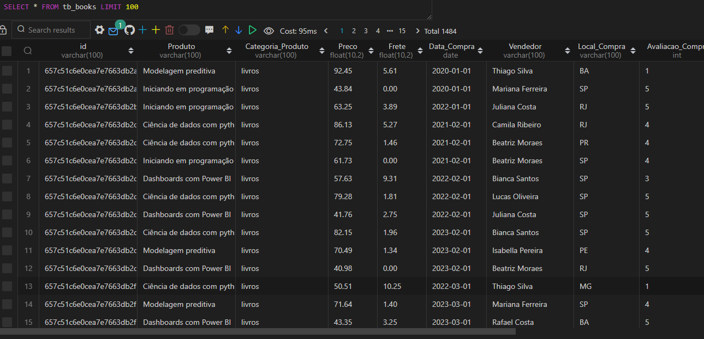

# Data Extraction and Integration Project
This project demonstrates how to extract data from an API and integrate it into MongoDB and MySQL databases. The data used for the demonstration is sourced from the LabDados - Products API.

# Objective
The aim of this project is to showcase a practical approach to extracting data from an API and integrating it into different database management systems, including MongoDB and MySQL.

### API Data Extraction:

Utilization of the [LabDados API](https://labdados.com/produtos) to retrieve information about products.

### Integration into MongoDB:

Creation of a Python notebook to extract data from the API and insert it into a collection in MongoDB.

### Integration into MySQL:

Implementation of a process to transfer data from the API to a table in a MySQL database.

### MySQL Database Snapshot

